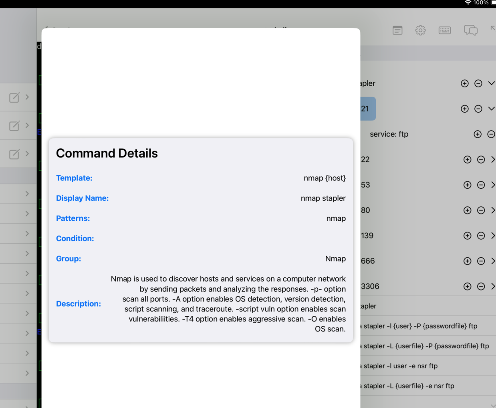
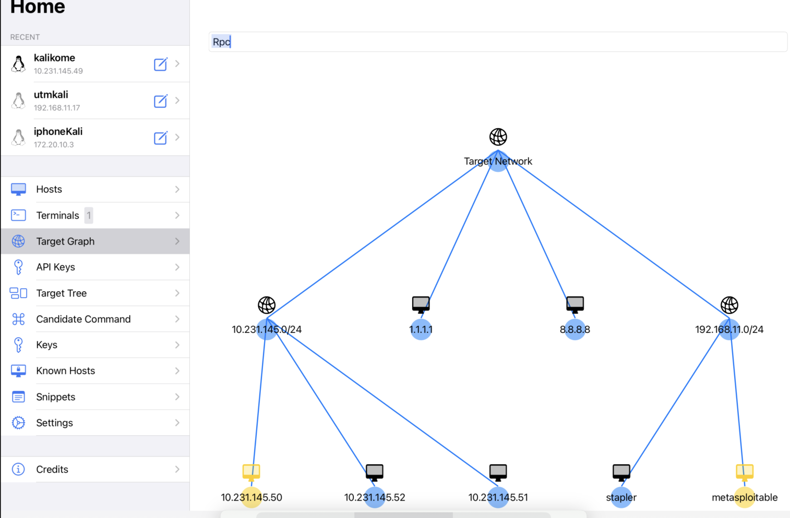

# EchidnaTermApp: Penetration Test Assist Tool


EchidnaTermApp is a SSH client application for iOS  specialized for learning cyber attack techniques.
This app can be downloaded from the App Store.

- https://apps.apple.com/jp/app/echidnatermapp/id6520381307?uo=2

This tool is created based on SwiftTermApp and implemented by integrating the features of Echidna to learn Cyber Security. 
Both of them are open source, and SwiftTermApp is available in the App Store for iPhone and iPad.

- https://github.com/migueldeicaza/SwiftTermApp
- https://github.com/Echidna-Pentest/Echidna

The main page of EchidnaTermApp is as follows, where the terminal, target information, and candidate commands for attack are displayed simultaneously.


This is a demo of EchidnaTermApp being used on an actual iPad.


In addition to the features of SwiftTermApp, the following features from Echidna have been additionally implemented to facilitate learning cyber attack techniques.

Some of the features:
Echidna has the following features to assist beginners or teams in conducting penetration testing.
- Target Tree: Echidna extracts command input and outputs and automatically reflects them in the Target Tree.
- Command Suggestion: Suggest candidate commands based on the selected target tree node or current situation and execute them upon clicking.
- Target Graph: Echidna visualizes the target tree in Graph format
- Chat and AI Analysis: Echidna analyzes the terminal outputs with OpenAI in the background and notify a user if Echidna finds some attack path through the Chat component.
- Target Tree Analysis: Analyze Target Tree and highlight it if some critical vulnerabilities are found and display the Machine having the same vulnerability in the Hack The Box.

Unlike Echidna, which is implemented using http as a server-client system, EchidnaTermApp is implemented using ssh and only requires a client.
Because it is client-only, unlike Echidna, it cannot support multiple people working together, but it is lightweight and easy to use.
Unlike Echidna, no setup work is required on Kali Linux; you can use it just by installing EchidnaTermApp on your iPad (Just only starting the ssh service by `sudo systemctl start ssh`).

Since it can be run on an iPad, my goal is to make it possible to casually learn about hacking even when relaxing in the living room or on the sofa, even for students or children.


### Target Tree
Extract command output results and automatically reflect them in the Target Tree Component.
Implementing a parser script for each command is required to reflect the terminal output in Target Tree Component.

Parser scripts for the below commands are implemented currently.
- Scan commands (commands to use before initial shell)
  
  nmap, ping, hydra, nikto, smbmap, whatweb

You can add and remove target nodes by pressing plus/minus button.
You can also edit target node values by long pressing the target node. 


### Command Suggestion
Suggest candidate commands based on the selected target tree node.

Example)
- http (port 80) service added and selected in Target tree - > show HTTP scan commands (nikto, wpscan, dirb, sqlmap, etc) in the Candidate Command component.
- Vulnerable services like vsftpd 2.3.4 added and selected in Target tree -> show exploit command for vsftpd 2.3.4.

Adding the below format in commands.txt is required to display them in the Candidate Command component.
The items (host) enclosed in "{}" in the template are automatically replaced with the target information registered in the target tree.
When a condition is set, it will be displayed when you select a node containing that keyword from the target tree. For example, if you set the condition to http, it will be displayed when you select a node containing http in the target tree.

- commands.txt

```
[Echidna]
pattern: whatweb
description: WhatWeb identifies websites. It recognises web technologies including content management systems (CMS), blogging platforms, statistic/analytics packages, JavaScript libraries, web servers, and embedded devices.
template: whatweb {host}
template: whatweb {host}:{port}
condition: ["http", "https", "80", "443"]
group: HTTP
[end]
```

Currently, below commands are registered.
Ex)
- Scan commands (commands to use before initial shell)

whatweb, smbclient, smtp_version enum command, enum command for rpc, etc

- Exploit Commands

ms17-010, exploit for vsftpd 2.3.4, HttpFileServer 2.3.x, tomcat, sqlmap, etc

- Login Commands

ftp, ssh, crackmapexec, vncviewer, telnet, rlogin, etc

- Privilege escalation commands (commands to use after the initial shell)

meterpreter related commands, spawn shell commands, netstat, etc

You can add your own command from CandidateCommand Page in real time.


You can press and hold a command to see its description.




### Target Graph
You can view the target tree graphically by clicking the Graph button in the navigation bar.
It's possible to search target information and exeute commands from this graph.
This Graph will be helpful when you attack multiple hosts in a Network like Hack The Box Pro Labs, VULNLAB, etc.

Additionally, this feature is user-friendly and easy for beginners to get started with as it visualizes the target information.




This gif demonstrates the Graph Function and adding Candidate Command.


### Chat and AI Analysis
If you enable the AI ​​Analysis option on the API Key page and register your OpenAI API Key, the terminal output will be analyzed using the OpenAI API.
If you add @AI to the beginning, Echidna will analyze the received text using the OpenAI API.
Analysis results are returned through the chat component.


### AI Analysis and CandidateCommands
AI Analysis and CandidateCommands are integrated, so when AI Analysis is enabled, AI-suggested commands are displayed in the OpenAI and Gemini groups.


A function to score the CandidateCommands from 0 to 100 using the OpenAI and Gemini APIs has been implemented. OpenAI's score for each command is displayed on the left, while Gemini's score is shown on the right.


You can also ask questions for OpenAI and Gemini AI.


